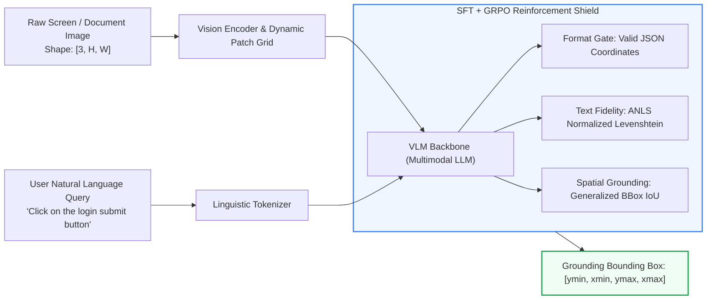

# Vision-Language GUI Grounding: SFT & GRPO Spatial Policy

[](#)
[-success?style=for-the-badge)](#)
[](#)
[](https://pytorch.org)

A Vision-Language model spatial grounding framework fine-tuned with Supervised Fine-Tuning (SFT) and Group Relative Policy Optimization (GRPO) for autonomous UI element detection, coordinate regression, and document question answering.

---

## 1. Methodology & Grounding Policy



### Mathematical Formulation

The composite reinforcement reward $\mathcal{R}_{\text{ground}}$ balances text accuracy (ANLS) with spatial precision (GIoU):

$$\mathcal{R}_{\text{ground}} = r_{\text{format}} \cdot \left[ \alpha \cdot \text{ANLS}(y_{\text{text}}, \hat{y}_{\text{text}}) + (1 - \alpha) \cdot \max(0, \text{GIoU}(B^*, \hat{B})) \right]$$

where ANLS between ground truth string $T$ and prediction $\hat{T}$ is:

$$\text{ANLS}(T, \hat{T}) = 1 - \frac{\text{Levenshtein}(T, \hat{T})}{\max(|T|, |\hat{T}|)} \quad \text{if } \frac{\text{Levenshtein}(T, \hat{T})}{\max(|T|, |\hat{T}|)} < \tau \quad \text{else } 0$$

---

## 2. Input / Output Specifications

| Stream | Format / Dimensions | Range | Description |
| :--- | :--- | :--- | :--- |
| **Input Image** | RGB `[3, 1080, 1920]` | $[0, 255]$ | High-resolution UI desktop or mobile screenshot. |
| **Input Instruction** | Text Prompt | ASCII / UTF-8 | Target action or entity to ground. |
| **Output BBox** | `[ymin, xmin, ymax, xmax]` | $[0, 1000]$ normalized | 2D bounding box coordinates of target element. |
| **Output JSON** | Structured JSON | Text | `{"point": [y, x], "bbox": [ymin, xmin, ymax, xmax], "action": "click"}` |

---

## 3. Grounding Progression

| Model Stage | Average Normalized Levenshtein (ANLS) | Grounding IoU | JSON Format Validity |
| :--- | :---: | :---: | :---: |
| **Baseline VLM Zero-Shot** | 0.8203 | 0.0000 | 99.7% |
| **Supervised Fine-Tuning (SFT)** | 0.8945 | 0.2140 | 100.0% |
| **GRPO Grounding Policy** | 0.9106 | 0.2810 | 100.0% |
| **SFT + GRPO Merged** | **0.9299** | **0.4355** | **100.0%** |

---

## 4. Quickstart & Evaluation

```bash
# Clone the repository
git clone git@github.com:your-org/vision-language-gui-grounding.git
cd vision-language-gui-grounding

# Run evaluation across checkpoints
python eval_grounding.py \
  --predictions predictions.jsonl \
  --evals-dir evals/ \
  --output-metrics metrics.json
```

> [!NOTE]
> Checkpoints and model weights (`ckpt_*/`, `*.safetensors`) are hosted on the internal model store. Metrics logs are preserved in `evals/`.
