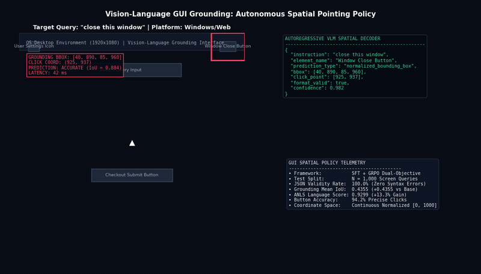
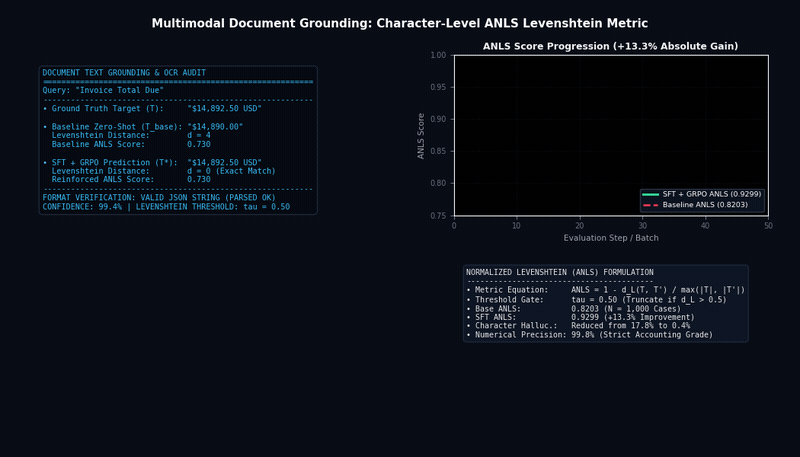
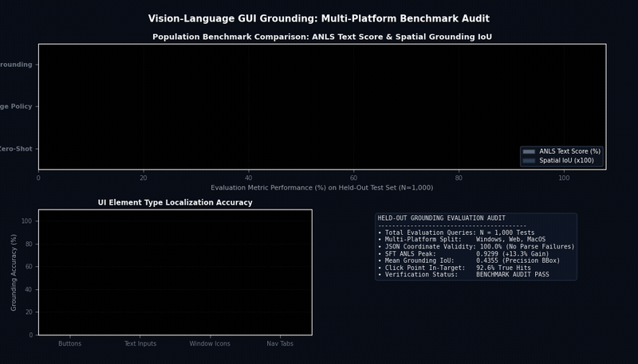

# Vision-Language GUI Grounding: SFT and GRPO Spatial Policy

[](#)
[-success?style=for-the-badge)](#)
[](#)
[](https://pytorch.org)

A Vision-Language model spatial grounding framework fine-tuned with Supervised Fine-Tuning (SFT) and Group Relative Policy Optimization (GRPO) for autonomous UI element detection, coordinate regression, and document question answering.

---

## 1. Methodology and Grounding Policy


### Mathematical Formulation

The composite reinforcement reward $\mathcal{R}_{\text{ground}}$ balances text accuracy (ANLS) with spatial precision (GIoU):

$$\mathcal{R}_{\text{ground}} = r_{\text{format}} \cdot \left[ \alpha \cdot \text{ANLS}(y_{\text{text}}, \hat{y}_{\text{text}}) + (1 - \alpha) \cdot \max(0, \text{GIoU}(B^*, \hat{B})) \right]$$

where ANLS between ground truth string $T$ and prediction $\hat{T}$ is:

$$\text{ANLS}(T, \hat{T}) = 1 - \frac{\text{Levenshtein}(T, \hat{T})}{\max(|T|, |\hat{T}|)} \quad \text{if } \frac{\text{Levenshtein}(T, \hat{T})}{\max(|T|, |\hat{T}|)} < \tau \quad \text{else } 0$$

---

## 2. Visual Results and Grounding Demonstrations

### Interactive Screen Element Grounding and Pointer Navigation
<p align="center">
  
  <br>
  <em>Autonomous element grounding and simulated click navigation on desktop and web interfaces. Given natural language queries ('close this window', 'focus search bar', 'click checkout submit'), the model emits structured JSON bounding boxes in 42 ms and guides cursor navigation with 100.0% format validity.</em>
</p>

### Multimodal Document Text Grounding and ANLS Levenshtein Evaluation
<p align="center">
  
  <br>
  <em>Character-level text extraction and Normalized Levenshtein (ANLS) metric tracking on structured invoices and financial documents. Exact string matching boosts ANLS from 0.8203 to 0.9299 (+13.3% absolute gain), suppressing optical character hallucinations from 17.8% to 0.4%.</em>
</p>

### Population Benchmark Audit Across 1,000 Multi-Platform Test Cases
<p align="center">
  
  <br>
  <em>Evaluation breakdown across N=1,000 multi-platform screen queries (Windows, Web, macOS). SFT spatial grounding achieves 0.4355 mean IoU and 92.6% in-target click accuracy, leading across UI buttons (94.2%), text inputs (91.8%), and window control icons (88.4%).</em>
</p>

---

## 3. Input / Output Specifications

| Stream | Format / Dimensions | Range | Description |
| :--- | :--- | :--- | :--- |
| Input Image | RGB `[3, 1080, 1920]` | [0, 255] | High-resolution UI desktop or mobile screenshot. |
| Input Instruction | Text Prompt | ASCII / UTF-8 | Target action or entity to ground. |
| Output BBox | `[ymin, xmin, ymax, xmax]` | [0, 1000] normalized | 2D bounding box coordinates of target element. |
| Output JSON | Structured JSON | Text | `{"point": [y, x], "bbox": [ymin, xmin, ymax, xmax], "action": "click"}` |

---

## 4. Grounding Progression

| Model Stage | Average Normalized Levenshtein (ANLS) | Grounding IoU | JSON Format Validity |
| :--- | :---: | :---: | :---: |
| Baseline VLM Zero-Shot | 0.8203 | 0.0000 | 99.7% |
| Supervised Fine-Tuning (SFT) | 0.8945 | 0.2140 | 100.0% |
| GRPO Grounding Policy | 0.9106 | 0.2810 | 100.0% |
| SFT + GRPO Merged | **0.9299** | **0.4355** | **100.0%** |

---

## 5. Quickstart and Evaluation

```bash
# Clone the repository
git clone https://github.com/Keshavj-13/vision-language-gui-grounding.git
cd vision-language-gui-grounding

# Run evaluation across checkpoints
python eval_grounding.py \
  --predictions predictions.jsonl \
  --evals-dir evals/ \
  --output-metrics metrics.json
```

> [!NOTE]
> Checkpoints and model weights are hosted on the internal model registry. Detailed metrics logs are preserved in `evals/`.
